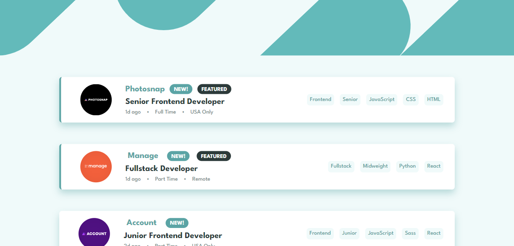

# Frontend Mentor - Job listings with filtering solution

This is a solution to the [Job listings with filtering challenge on Frontend Mentor](https://www.frontendmentor.io/challenges/job-listings-with-filtering-ivstIPCt). Frontend Mentor challenges help you improve your coding skills by building realistic projects. 

## Table of contents

- [Overview](#overview)
  - [The challenge](#the-challenge)
  - [Screenshot](#screenshot)
  - [Links](#links)
- [My process](#my-process)
  - [Built with](#built-with)
  - [What I learned](#what-i-learned)
  - [Continued development](#continued-development)
- [Author](#author)

**Note: Delete this note and update the table of contents based on what sections you keep.**

## Overview

### The challenge

Users should be able to:

- View the optimal layout for the site depending on their device's screen size
- See hover states for all interactive elements on the page
- Filter job listings based on the categories

### Screenshot

### Links

- Solution URL: [github](https://github.com/CranJeus/static-job-listings)
- Live Site URL: [netlify](https://curious-crisp-0ad257.netlify.app/)

## My process
I started with a blank next.js application, i then implemented my needed globals for themeing and worked on creating a component for a card, the jobListing class. From there i learned how to pass my needed data with its respective interface and also passed an arrow function to handle the onclick of each tag. from here i needed to filter the dat so that the onclick would accomplish anything. I implemented this filter and passed the new filtered information to the map function to render my cards. I then implemented the header which includes the filtered tags and handled that much in the same way i rendered my cards. 

All throughout this process i had to check how the app was scaling and handling the changes so there was a lot of CSS changes throughout.

### Built with

- Semantic HTML5 markup
- CSS custom properties
- Flexbox
- CSS Grid
- [React](https://reactjs.org/) - JS library
- [Next.js](https://nextjs.org/) - React framework
- Custom Components
- UseState

### What I learned

a lot of what i learned is implementation, this small app works more like an android app where the function pointers are being passed to children so they can interact with data from the main app. So here i learned more about custom components and implementing them in a more structured way. Each component has its own interface so what is needed for their implementation is known without long lists of parameters to be passed.

### Continued development

Most of my time was spent on themeing and styling these components especially the filterbar and my original implementation of pseudo elements for the filterbar tags. Knowing how to more easily move and shape the objects to my needs would have alleviated much of the issue so practice is needed.

## Author

- Frontend Mentor - [@CranJeus](https://www.frontendmentor.io/profile/CranJeus)

